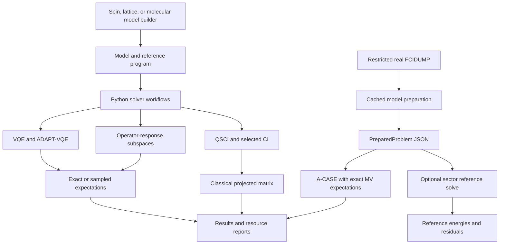

# Architecture

`clifford_qc` connects model construction, execution, eigensolvers, and
measurement analysis through a sparse Pauli algebra. Start with the
[README](README.md) for runnable examples and the
[architecture paper](paper_architecture/README.md) for the benchmark evidence.
This guide describes the implementation boundaries used by those workflows.

## Calculation paths

This is a data-flow diagram, not an import graph. The command-line pipeline
currently exposes prepared FCIDUMP inputs and exact A-CASE solves with a
determinant-excitation pool. `solve_prepared` reconstructs the model and builds
its reference density through `ExactMVBackend`; `validate_prepared` instead
uses `SectorStatevectorBackend`. A sector-restricted validation does not make
the A-CASE solve use a sector statevector. Other algorithms and sampled
workflows use Python interfaces. Validation remains a separate optional
calculation; its cost is not charged to the solver record. See
[PIPELINE.md](PIPELINE.md) for commands, defaults, and artifact contents.

## Layers and responsibilities

Package paths below are relative to `clifford_qc/`; `benchmarks/` is at the
repository root. Examples and manuscripts consume the package rather than
providing another runtime implementation.

| Layer | Main locations | Responsibility |
|---|---|---|
| Algebra | `multivector.py`, `pauli_kernel.py`, `pauli.py`, `clifford.py`, `fermion.py`, `gates.py`, `states.py`, `channels.py` | Sparse operators, products, states, evolution, and fermionic conventions |
| Program representation | `ir.py`, `qasm3.py`, `fermion_mapping.py` | Pauli sums, rotor programs, parameters, serialization, export, and encodings |
| Models | `models/` | Hamiltonians, reference programs, sector metadata, orbital bases, and observables |
| Execution | `backends/`, `dense_reference.py`, `sparse.py`, `pauli_action.py` | Exact, sampled, stabilizer, dense, sparse, and sector calculations |
| Measurement | `measurement/` | Grouping, readout compilation, caches, functionals, covariance, allocation, confidence, and device cost |
| Algorithms | `algorithms/` | VQE, ADAPT-VQE, optimizers, candidate pools, and initialization |
| Subspaces | `subspace/` | Projection, adaptive growth, sampled determinants, classical controls, hybrids, response, and restrictions |
| Orchestration | `workflows.py`, `prepared.py`, `pipeline.py` | Cross-layer workflows and reusable preparation/solve/validation |
| Interoperability | `bridges/` | Explicit optional adapters for external quantum software |
| Evidence | `benchmarks/`, `verify.py`, `reproducibility.py`, `record_environment.py`, `capabilities.py` | Smoke checks, records, validation gates, and environment provenance |

This task-oriented map groups reference calculations with execution. The
paper's formal module partition assigns the root reference helpers to the
algebra kernel. For current counts and exact assignments, use the generated
[source census](paper_architecture/data/source_census.json). Counts are not
copied into this guide, so adding a module does not leave stale size claims.

## Operator and program boundary

`MV` stores a sparse map from packed Pauli-word codes to complex coefficients.
Each qubit uses two bits: `0=I`, `1=X`, `2=Y`, `3=Z`. `PauliSum` is the public
Hamiltonian/observable container; `to_mv()` and `from_mv()` change containers
without changing the Pauli basis or operator semantics.

`Program` holds named Clifford gates, Pauli rotors, parameters, and measurement
tasks. Its operations have exact `MV` semantics. OpenQASM is an export pass;
optional bridges accept their documented subsets. The three scalar pairings
on `MV` are distinct: see [CONVENTIONS.md](CONVENTIONS.md) before substituting
`scalar_product`, `hs_product`, or `trace_pairing` for one another.

A `Model` carries a Hamiltonian, reference program, named variational layers,
and metadata. Its dataclass is frozen, but contained objects are not generally
immutable. `PreparedProblem` instead preserves a serialized snapshot with a
content digest and gives each consumer fresh model and metadata objects.

`prepared.py` owns cache identity and artifact validation. `pipeline.py` owns
the molecular command-line stages. `workflows.py` composes Python-level
algorithms, including warm starts. Solver configuration and state transitions
remain in their algorithm modules; orchestration does not merge A-CASE's
generalized eigenproblem with ADAPT-VQE's parameter optimization.

## Execution interfaces

`Backend` supplies program state and expectation evaluation. `SamplingBackend`
extends the execution vocabulary with sampled words and groups. A `GroupSample`
contains a joint histogram for either a qubit-wise setting or an explicitly
keyed Clifford-diagonalized setting with signed readouts. A `MeasurementBatch`
keeps the resulting samples and shot accounting together.

The sector backend has a specialized statevector/operator interface. It stores
amplitudes in a declared particle/spin sector and checks operator invariance;
it is not interchangeable with every density-operator path. Stabilizer
execution accepts the Clifford subset and requires Stim. Neither backend is a
general acceleration for arbitrary programs.

## Solvers and virtual bases

A-CASE builds directions `A_i |psi>` and reconstructs

\[
S_{ij}=\langle\psi|A_i^\dagger A_j|\psi\rangle,\qquad
H_{ij}=\langle\psi|A_i^\dagger H A_j|\psi\rangle.
\]

The generalized solve `Hc = ESc` includes overlap thresholding and conditioning
checks. `Generator` names a direction; `MatrixElementBank` caches projected
operator rows, exact values, and support information. Adaptive selection can
account for new measured words. Projected observables reuse the basis for
expectations and transitions without materializing a full Ritz state.

Energy-based candidate scoring uses a generalized two-dimensional problem
containing a current Ritz state and the candidate. It also reports the
magnitude of `<chi|(H - E)|Psi>` normalized by the candidate norm. The overlap
matrix is retained, and candidates nearly dependent on the whole retained
subspace are rejected. This residual coupling samples
one direction of the residual. It is not the full residual norm, and a
candidate-pool stopping rule does not certify the full ground-state error.

QSCI/SQD constructs a determinant subspace from computational-basis samples and
builds its projected Hamiltonian classically. Selected-CI controls expose what
classical selection alone achieves. Hybrid bases add operator-response
directions to sampled configurations. ADAPT-VQE can supply a warm reference
through `workflows.adapt_warm_start`.

The default bank retains constructed object rows. Packed coefficients and
streaming are separate choices: representation controls how a row is stored;
lifetime policy controls whether it remains resident. Streaming retains the
selected block and a bounded frontier, evicts other rows, and recomputes them
when needed. Functional snapshots can outlive bank eviction. The coefficient
row bound excludes histories, word tables, reference states, generator
products, and projected observables; it is not a process-memory bound.

## Reduction semantics

| Mechanism | What becomes smaller | Conditions and limits |
|---|---|---|
| Sector representation | Stored amplitudes and reference linear algebra | Exact within a preserved particle/spin sector; does not remove model qubits |
| Symmetry tapering | Active register after Clifford rotation and fixing symmetry qubits | Exact in the chosen symmetry sector |
| Contextual restriction | Active register and retained Hamiltonian | Approximate; removed Hamiltonian norm and resulting bias must be reported |
| Operator-response projection | Generalized eigenproblem over virtual directions | Finite basis can retain subspace bias; logical qubit register is unchanged |
| Determinant projection | Matrix over sampled or selected configurations | Truncated variational subspace, normally within a declared sector |
| Generator filtering | Candidate pool and selection work | Does not itself reduce the Hilbert space |

`fermion_mapping.py`, `subspace/restriction.py`, and `subspace/contextual.py`
implement different uses of the rotate-and-fix boundary. A restriction must
transport the Hamiltonian, reference, generators, and observables consistently.
These operations can be composed, but their accuracy implications differ.

### Projectors and idempotents

`states.ket_density` builds a computational-state projector as a product of
commuting factors `(I +/- Z_j)/2`. `states.measure` uses projectors for outcome
probabilities and conditional density operators. A primitive rank-one
idempotent can also generate a minimal left ideal representing all kets;
choosing that ideal alone does not restrict the physical state space.

A physical-sector projector instead selects allowed particle/spin or symmetry
sectors. The sector backend stores only their occupation-basis amplitudes and
checks the combined operator action for invariance. Its explicit
`sector_projector` helper is for small-system validation, not the execution
representation. `Restriction.operator` implements `P O P` on a smaller
register after rotation and fixing; this compression preserves products only
for sector-preserving operands. `subspace.ga_restriction` also uses supplied
restrictions to discard candidate operators whose compressed image vanishes.

## Measurement and evidence

Grouping and a compiled measurement plan determine settings and signed parity
readouts. The sampler returns joint histograms. A cumulative cache shares
measured words among observables; a `WordFunctional` reads their linear
combinations. Allocation can use within-setting covariance. Cross-setting shot
pooling is optional and changes how compatible measurements are combined.

The evidence vocabulary includes `exact`, `asymptotic`, `finite_sample`,
`heuristic`, and `none`. `EvidenceLevel` is an enumeration in the selection
layer, but other result types and legacy records use strings without uniform
schema validation. The paper's census measures that coverage gap.

Exact projected arithmetic does not establish full-space convergence. A
finite-sample interval applies to its specified functional and assumptions;
bootstrap response intervals remain heuristic. Subspace bias and sampling
uncertainty may enter one accuracy budget, provided their sources and
guarantees remain explicit.

Device cards evaluate compiled settings under connectivity, duration, and
fidelity assumptions. Inadmissible protocols have no reported runtime. The
cards are illustrative logical accounting, not calibrated hardware predictions.
A setting count alone cannot establish a time saving.

## Dependency boundaries

Most imports follow the layers, with recorded exceptions:

- Chemistry model construction imports `algorithms/pools.py` at module scope.
- Measurement methods import subspace linear algebra or restriction helpers
  at call time. Type-checking-only imports do not execute.
- Some kernel sector helpers call execution code through deferred imports.
- Optional bridges and chemistry generators are imported by name rather than
  eagerly loaded by the package initializer. Compiling block measurement plans
  or restrictions can load Stim at call time.

Deferred imports control initialization order; they do not make the runtime
dependency graph acyclic. The core installation needs NumPy. SciPy reference
paths, chemistry generation, and ecosystem adapters require their extras.

## Records and checks

Benchmark producers write records; gates check specific properties of them.
Some gates rebuild values, while others validate preregistered configurations,
lineage, dependency environments, documentation, or cross-artifact consistency.
Not every producer has a numerical rebuild gate. The generated census records
the current classifications and CI coverage.

Automatic CI runs tests, lint, manuscript checks, and selected scientific gates.
Expensive sampled checks require manual dispatch. Single-thread numerical
settings control one source of floating-point variation but do not guarantee
bitwise portability across machines. [REPRODUCING.md](REPRODUCING.md) specifies
the frozen environments, commands, and scope of each check.

The architecture manuscript regenerates quantitative tables and source counts,
checks figure provenance, and validates citations and references. These checks
keep documentation tied to its sources; they do not establish performance or
scientific advantage.
