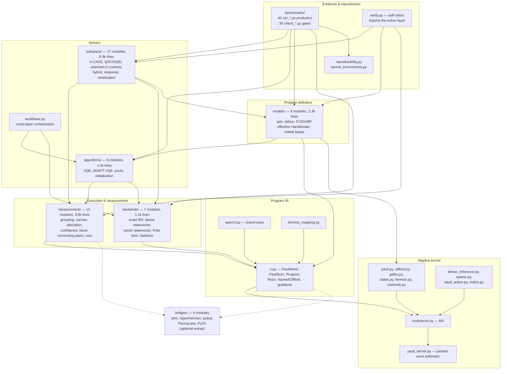
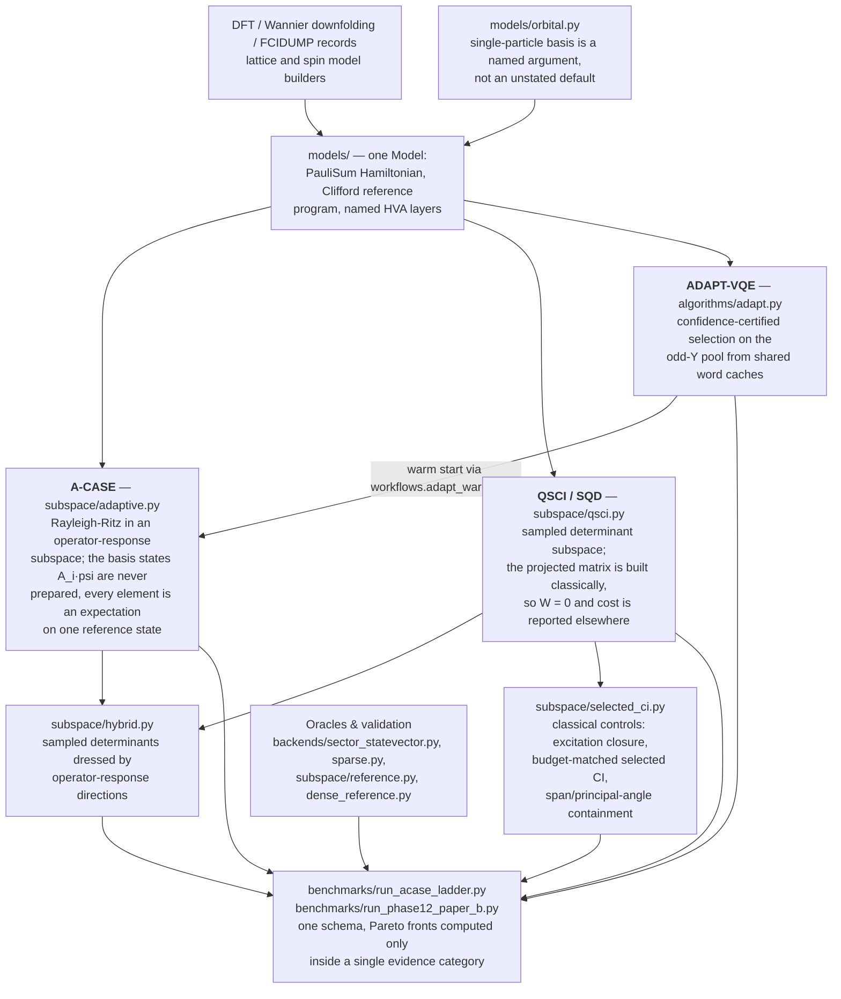
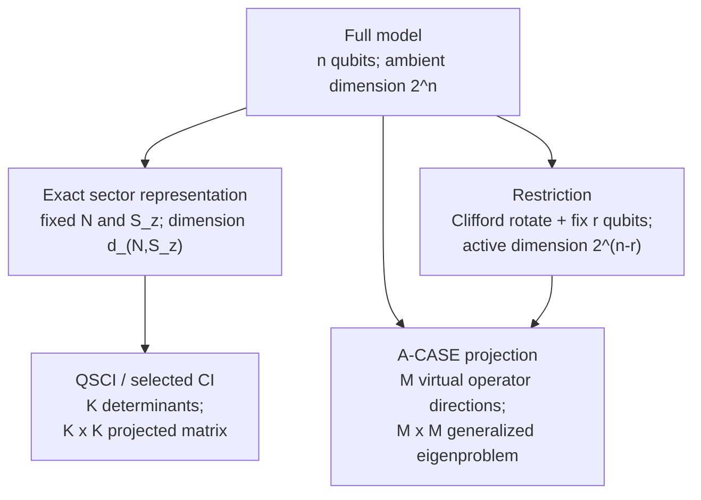
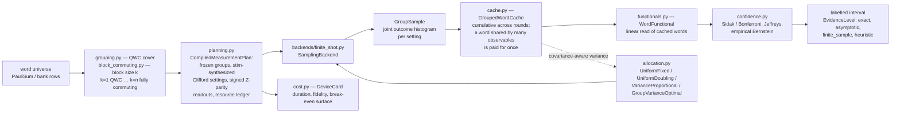

# `clifford_qc` architecture

The package separates algebra, problem definition, execution, measurement,
solvers, orchestration, and evidence. The generated
[architecture census](paper_architecture/data/source_census.json) contains the
current module and line counts; the older diagrams below are scoped snapshots.

[PIPELINE.md](PIPELINE.md) documents the new `prepared.py` and `pipeline.py`
orchestration boundary: reusable FCIDUMP preparation feeds independent solves
and optional validation. `subspace/streaming.py` supplies coefficient lifetime
policy beneath A-CASE; `measurement/functionals.py` compiles independent ordered
snapshots. Neither a storage policy nor a cache changes the physical model.

Two things explain most of the layout.

1. **One algebra across an explicit IR boundary.** The numerical kernel uses
   the sparse Pauli-word object `MV`; models and programs expose the public
   `PauliSum` container and lower it exactly with `to_mv()`. The boundary changes
   containers, not word codes, algebraic basis, or operator semantics.
2. **Typed paths carry what kind of number they produce.** `EvidenceLevel`
   (`exact` / `asymptotic` / `finite_sample` / `heuristic` / `none`) threads
   from the measurement layer through the solvers into newer committed
   records, and the benchmark gates compare against it where declared. The
   architecture-paper census exposes legacy records where this is not yet an
   enforced invariant. Much of the layering exists to
   keep an oracle-fed quantity from being reported beside a measured one
   without a label.

---

## 1. Layer stack

Solid arrows are selected **import-time** dependencies: edges executed when a
module is first loaded. Most point downward, but the optional chemistry module
is a named exception: `models/chemistry.py` imports
`algorithms/pools.py`. The figure records that edge instead of claiming a
strictly layered initialization graph.

Deferred imports are a different graph. A function-scope import is still a real
runtime import; it just runs at call time rather than at load time, and several
of those *do* point upward — `measurement/` into `subspace/`, the kernel into
`backends/`. Collapsed to the package level, the call-time graph therefore has
upward and bidirectional edges and is not acyclic. Section 5 lists every one of
them.

Dotted edges are optional. The invariant is about *when*, not *how many*: no
ordinary package import eagerly loads `stim`. It is pulled in at call time by
`compile_block_measurement_plan`, by `compile_contextual_restriction` in
`subspace/contextual.py`, and by `EncodingMap.restriction` in
`fermion_mapping.py` (through `bridges.stim_bridge`); `backends/stabilizer.py`
and `measurement/block_synthesis.py` import it at module level but are not
re-exported, so reaching them means naming them. Those are entry paths, not an
exhaustive count — the property to rely on is that `import clifford_qc` does
not need the extra installed.

### Layer inventory

| Layer | Location | Lines | Owns |
|---|---|---:|---|
| Algebra kernel | `multivector.py`, `pauli_kernel.py`, `pauli.py`, `clifford.py`, `gates.py`, `states.py`, `fermion.py`, `channels.py`, `dense_reference.py`, `sparse.py`, `pauli_action.py`, `pauli_structure.py`, `diagnostics.py`, `matrix.py`, `selection.py` | 1,970 | `MV`, packed word codes, the three pairings, JW generators, CAR operators, dense/sparse references, the evidence vocabulary |
| Program IR | `ir.py`, `qasm3.py`, `fermion_mapping.py` | 1,209 | Pauli-rotor programs, parameters, gradients, QASM3 export, encoding choice |
| Execution | `backends/` | 1,058 | The `Backend` / `SamplingBackend` protocol and its five implementations |
| Measurement | `measurement/` | 3,924 | QWC and block-commuting grouping, shot allocation, cumulative caches, confidence bounds, device cost |
| Models | `models/` | 2,338 | Hamiltonians and observables from lattices, FCIDUMP records, Wannier/embedding JSON, orbital bases |
| Algorithms | `algorithms/` | 1,428 | Fixed-depth VQE, ADAPT-VQE with certified selection, pools, Clifford-point seeding |
| Subspace solvers | `subspace/` | 8,866 | A-CASE, QSCI/SQD, classical selected-CI controls, hybrid arms, response spectra, growth certificates |
| Evidence | `benchmarks/`, `verify.py`, `reproducibility.py`, `record_environment.py` | 966 + benchmarks | Record producers, drift gates, environment provenance |

---

## 2. Solver stack

What the layers above `models/` actually compute, and how the arms relate.
This is the diagram that matters for reading results: the three solver arms
are deliberately comparable, and the bottom row is what they are scored
against.

### Where computational-space reduction happens

`models/` constructs the problem; it does **not** silently reduce the
computational space. Reduction is explicit, and the repository uses the word
"subspace" for several operations with different mathematical and resource
meanings:

| Mechanism | Code path | What becomes smaller | Evidence boundary |
|---|---|---|---|
| Fixed-`(N, S_z)` sector representation | `backends/sector_statevector.py` | The statevector and exact eigensolver use only the sector basis: for the standard two-spin ordering, `d_(N,S_z) = C(n/2,N_up) C(n/2,N_down)` instead of `2^n` | Exact. It compresses storage and linear algebra but does not remove qubits from the `Model` |
| Symmetry tapering / reduced fermion encoding | `fermion_mapping.py` → `subspace/restriction.py` | A Clifford rotation exposes `r` fixed parity qubits, then `Restriction` deletes them: `n_active = n-r` | Exact when every fixed stabilizer is a symmetry of the full Hamiltonian. The `parity+2q` and `bk+2q` arms remove two qubits this way |
| Contextual restriction | `subspace/contextual.py` → `subspace/restriction.py` | The same rotate-then-fix primitive produces an `(n-r)`-qubit problem, while terms anticommuting with the selected contextual stabilizers are projected away | Approximate. The record carries the removed Hamiltonian Hilbert--Schmidt fraction; this must not be presented as exact symmetry tapering |
| A-CASE projection | `subspace/projection.py`, `subspace/adaptive.py` | Rayleigh--Ritz is solved in `span{A_i psi}`, giving an `M x M` generalized eigenproblem `Hc = ESc` | Variational. The `A_i psi` directions remain virtual expectation-value constructions; this does not shrink the logical qubit register |
| QSCI / selected-CI projection | `subspace/qsci.py`, `subspace/selected_ci.py` | The Hamiltonian is restricted to `K` sampled or selected determinants and solved as a `K x K` matrix | Truncated variational subspace, normally inside the exact sector representation |
| Generator preconditioning | `subspace/ga_restriction.py` | The candidate-generator pool and subsequent measurement/search work | **Not** a Hilbert-space reduction by itself; it changes which directions may enter a later projected solve |

These mechanisms are composable but not interchangeable. In the R4a path,
`compile_contextual_restriction` selects and rotates the contextual
stabilizers, then `project_contextual_problem` transports the Hamiltonian,
reference, generators, and observables through one shared `Restriction`.
A-CASE subsequently builds its smaller generalized eigenproblem from that
already reduced problem.

---

## 3. Finite-shot data path

The measurement layer is the part with the most structure, because it is where
a number acquires its evidence label. One pass, from a Hamiltonian to a
labelled interval:

The `GroupSample` contract carries both forms in one type: a QWC setting
identified by its per-qubit basis, or a Clifford-diagonalized setting with an
explicit `setting_key` and signed `readouts` map. That is what lets the
block-commuting hierarchy feed the same estimators without pretending it was
measured qubit-wise.

---

## 4. The seams

These are the interfaces that make the layers replaceable. Changing one is a
cross-cutting change; changing anything else is local.

| Seam | Defined in | Contract |
|---|---|---|
| `MV` | `multivector.py` | Sparse Pauli-word operator. Two bits per qubit (`0=I, 1=X, 2=Y, 3=Z`); multiplication is XOR/AND/popcount mod 4. Three distinct pairings — `scalar_product`, `hs_product`, `trace_pairing` — that are **not** interchangeable |
| `Program` / `PauliSum` | `ir.py` | The interchange layer. Named Cliffords, Pauli rotors `exp(-i·theta·P/2)`, ordered parameters, measurement tasks. Everything lowers exactly to `MV` |
| `Backend`, `SamplingBackend` | `backends/protocol.py` | The only way the algorithm layer talks to execution. Exact evaluation, plus finite-shot sampling returning `MeasurementBatch` |
| `GroupSample` | `backends/protocol.py` | One commuting setting's joint histogram — QWC basis or compiled Clifford readout |
| `Model` | `models/spin.py` | The `PauliSum` Hamiltonian, a Clifford `Program` preparing the reference product state, and named HVA layers. Every builder in `models/` emits this same frozen type |
| `Generator` | `subspace/generator_core.py` | One labelled basis direction `A_i` as an `MV`, whose state stays virtual; `support()` is the resource term `S_A` |
| `MatrixElementBank` | `subspace/projection.py` | Cached projected matrix elements and their word universe |
| `EvidenceLevel`, `SelectionStatus` | `selection.py` | The evidence contract, plus `canonical_argmax` — deterministic tie resolution shared by every selector |
| `CompiledMeasurementPlan` | `measurement/planning.py` | The public block-commuting boundary; freezes a word universe into groups, executable settings, and a matched resource ledger |
| `Restriction` | `subspace/restriction.py` | Symmetry-sector restriction of operators and states |
| `as_multivector`, `check_reference` | `subspace/contracts.py` | Representation coercion and reference-state validation |

---

## 5. Dependency rules and their recorded exceptions

The import-time graph is **not strictly layered**. Most dependencies point
downward, but the chemistry extra has one explicit module-scope exception:
`models/chemistry.py` imports `algorithms/pools.py` to construct its ADAPT
candidate pool. The call-time graph has additional upward edges. Each deferred
edge below still executes when its code path runs.

- **`measurement/` never imports `subspace/` *while initializing*.** It does
  import it at call time: `session.py` pulls `subspace.linalg` inside three
  methods, and `compiled.py` pulls `subspace.restriction` inside one.
  `functionals.py` and `session.py` additionally reference `MatrixElementBank`
  and `SubspaceResult` under `TYPE_CHECKING`, which never executes at all.
  `session.py` goes further and *restates* the canonical `linalg` tolerances
  with a comment saying why, rather than importing the higher layer during its
  own initialization — which is the point: the deferral buys initialization
  order, not independence.
- **`subspace/projection.py` pulls `measurement.grouping` inside a method**, so
  costing a word universe does not make the solver depend on the measurement
  package at import.
- **`workflows.py` exists precisely to keep `algorithms/` and `subspace/`
  apart.** It imports `algorithms.adapt` at call time so importing either
  numerical package does not eagerly initialize the other.
- **The kernel reaches upward into `backends/` at call time.** `fermion.py` and
  `pauli_action.py` pull `backends/sector_statevector.py` from function scope
  for sector helpers, and `fermion_mapping.py` pulls `subspace.restriction` the
  same way. These are genuine upward runtime edges; only their timing is
  constrained.
- **`multivector.py` pulls `dense_reference.to_matrix` inside a method**, so the
  kernel does not depend on the dense bridge at import.
- **Optional dependencies are kept out of every package `__init__`**, by one of
  two mechanisms. Either the import is function-scope — `stim` in
  `measurement/planning.py`, `subspace/contextual.py`, and
  `fermion_mapping.py` — or the module imports it at module level and is
  deliberately *not* re-exported, so reaching it requires naming it:
  `measurement/block_synthesis.py`, `backends/stabilizer.py`, and everything
  in `bridges/`. `models/chemistry.py` (PySCF + OpenFermion) uses the same
  non-re-export rule, so a bare install can still do
  `from clifford_qc.models import hubbard`.

The core package depends on `numpy` alone. `scipy` is the `research` extra;
everything else is per-bridge.

---

## 6. Evidence and reproduction architecture

`benchmarks/` is not a scratch directory — it is a two-part contract, and the
pairing is the architecture:

Four properties of this layer are load-bearing:

- **Producer/gate pairing, where it applies.** The 42 producers and 30 checkers
  are not two views of one list: only 18 share a stem. Read the checkers by
  what they actually assert, because "every record is re-derived" is a promise
  the repository deliberately does not make:

  | Class | Count | What it asserts |
  |---|---:|---|
  | Value-rebuilt | 18 | Same-stem `check_X` recomputes `run_X`'s record and fails on numeric drift |
  | Preregistration | 5 | A predeclared plan matches the committed constants — no rebuild |
  | Lineage / environment | 3 | Provenance stamping, environment migration, regeneration identity |
  | Documentation | 1 | `check_docs.py` on `REPRODUCING.md` |
  | Cross-artifact | 2 | `check_molecular.py` (against the root pipeline), `check_summaries.py` |

  The other 24 producers write manuscript evidence, paper-suite drivers, or
  exploratory output with no value gate. `REPRODUCING.md` names the notable
  case rather than excusing it: `acase_ladder.jsonl` is manuscript evidence, so
  no `check_*.py` rebuilds it — regenerating it would move published inputs
  across all five families. And `check_summaries.py` is deliberately not a gate
  yet, because five `*_summary` pairs declared by configs have no committed
  JSONL, so it fails on `main` today for reasons that predate the workflow.
  The workflow names 28 of the 30 checkers: 18 run on every pull request and
  10 require manual dispatch --- nine sampled-record gates plus the separate
  environment-consistency audit. `check_summaries.py` and
  `check_regenerated_record.py` are the two absent from the workflow.

- **One visible unit per gate.** The short automatic gates are individual named
  steps with `if: !cancelled()`. Structural and sampled gates are separately
  named matrix jobs with `fail-fast: false`, so a drift suite reports every
  symptom rather than stopping at the first within either execution class.
- **Thread pinning.** CI sets `OMP_NUM_THREADS=1` because threaded BLAS
  reductions sum in a thread-count-dependent order — `eigvalsh` returns four
  different last bits across `OMP_NUM_THREADS` 1..4. This closes the one source
  of nondeterminism a workflow can close; it does not make records portable
  across CPU microarchitectures, and `REPRODUCING.md` records the floor that
  leaves.
- **Documentation is gated too.** `check_docs.py` verifies that every command
  in `REPRODUCING.md` names a script that exists, that every long flag is one
  the script accepts, that predeclared constants match the source, that every
  producer is documented, that every committed record is named, and that the
  quoted `pytest` count matches what the suite collects.

---

## 7. Reading order

For someone new to the codebase:

1. `CONVENTIONS.md` — word codes, qubit ordering, the three pairings, rotor
   convention. Nothing below makes sense without it.
2. `multivector.py` then `pauli_kernel.py` — the whole engine is here.
3. `ir.py` — the interchange layer everything above speaks.
4. `backends/protocol.py` — the execution seam, and the `GroupSample` docstring
   for why grouped measurement is shaped the way it is.
5. `backends/sector_statevector.py`, `fermion_mapping.py`, and
   `subspace/restriction.py` — sector compression, encoding-aware tapering,
   and the distinction between fewer stored amplitudes and fewer active qubits.
6. `subspace/adaptive.py` and `subspace/projection.py` — A-CASE proper and
   its separate `M`-dimensional projected solve.
7. `selection.py` — short, and it explains the evidence vocabulary that the
   records, the ladder, and the manuscripts all use.
