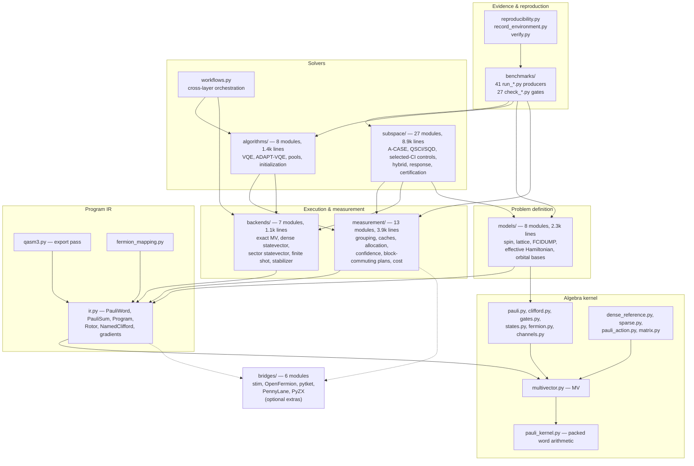
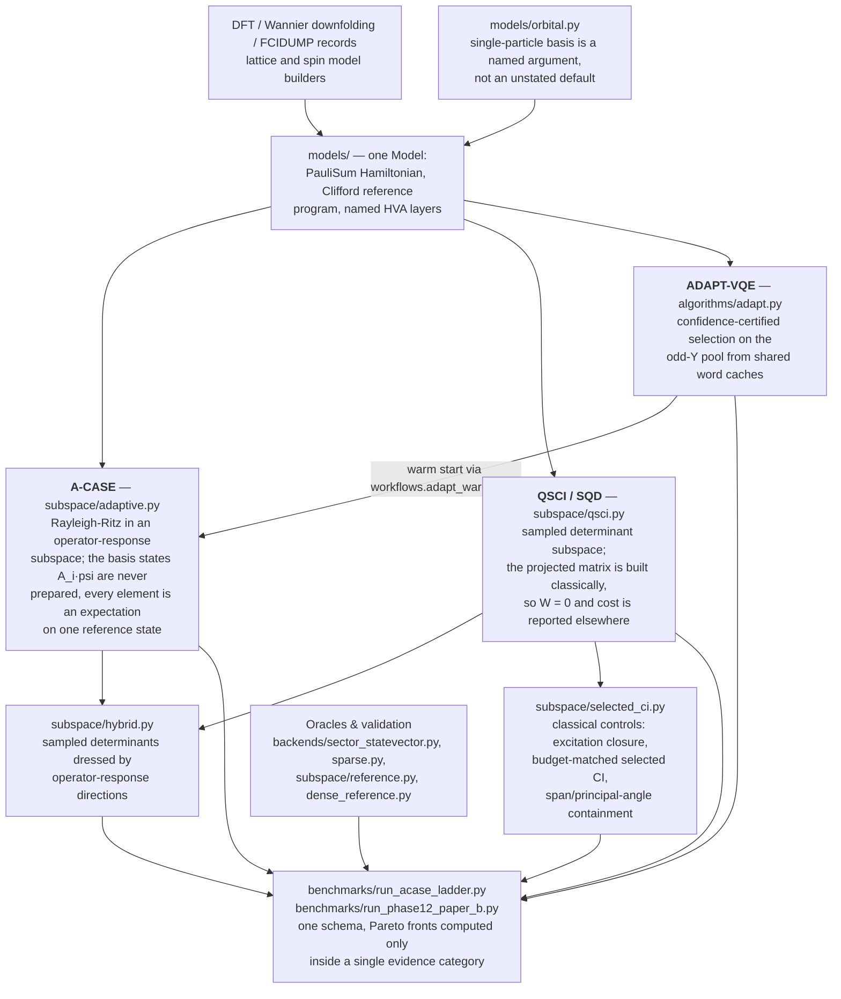
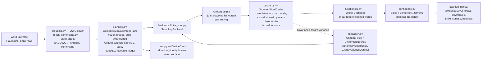
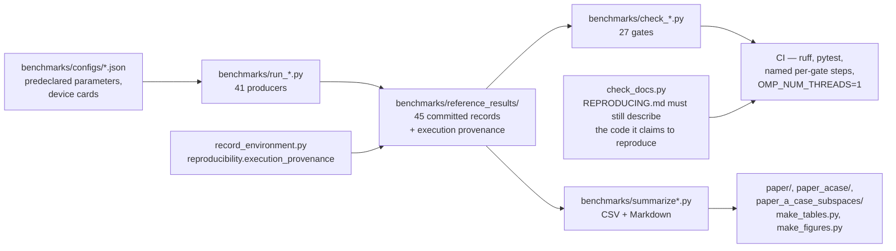

# `clifford_qc` architecture

The current shape of the package, derived from the source on this branch
rather than from intent: 92 modules and ~22.5k lines under `clifford_qc/`,
97 test modules and ~21.9k lines under `tests/`, 41 record producers and 27
record gates under `benchmarks/`.

Two things explain most of the layout.

1. **One representation all the way down.** States, gates, observables,
   channels, Jordan-Wigner Clifford generators, and CAR operators are all the
   same sparse Pauli-word object `MV`. There is no conversion boundary between
   "circuit land" and "operator land", so the layers above are free to move
   between them.
2. **Every number carries what kind of number it is.** `EvidenceLevel`
   (`exact` / `asymptotic` / `finite_sample` / `heuristic` / `none`) threads
   from the measurement layer through the solvers into the committed records,
   and the benchmark gates compare against it. Much of the layering exists to
   keep an oracle-fed quantity from being reported beside a measured one
   without a label.

---

## 1. Layer stack

Arrows are runtime `import` dependencies, and they only point downward.

Dotted edges are optional: `stim` is imported only when
`compile_block_measurement_plan` or the stabilizer backend is called, never at
package import.

### Layer inventory

| Layer | Location | Lines | Owns |
|---|---|---:|---|
| Algebra kernel | `clifford_qc/*.py` | 4,214 | `MV`, packed word codes, the three pairings, JW generators, CAR operators, dense/sparse references |
| Program IR | `ir.py`, `qasm3.py`, `fermion_mapping.py` | (in the above) | Pauli-rotor programs, parameters, gradients, QASM3 export, encoding choice |
| Execution | `backends/` | 1,058 | The `Backend` / `SamplingBackend` protocol and its five implementations |
| Measurement | `measurement/` | 3,924 | QWC and block-commuting grouping, shot allocation, cumulative caches, confidence bounds, device cost |
| Models | `models/` | 2,338 | Hamiltonians and observables from lattices, FCIDUMP records, Wannier/embedding JSON, orbital bases |
| Algorithms | `algorithms/` | 1,428 | Fixed-depth VQE, ADAPT-VQE with certified selection, pools, Clifford-point seeding |
| Subspace solvers | `subspace/` | 8,866 | A-CASE, QSCI/SQD, classical selected-CI controls, hybrid arms, response spectra, growth certificates |
| Evidence | `benchmarks/`, `reproducibility.py` | — | Record producers, drift gates, environment provenance |

---

## 2. Solver stack

What the layers above `models/` actually compute, and how the arms relate.
This is the diagram that matters for reading results: the three solver arms
are deliberately comparable, and the bottom row is what they are scored
against.

---

## 3. Finite-shot data path

The measurement layer is the part with the most structure, because it is where
a number acquires its evidence label. One pass, from a Hamiltonian to a
labelled interval:

The `GroupSample` contract carries both forms in one type: a QWC setting
identified by its per-qubit basis, or a Clifford-diagonalized setting with an
explicit `setting_key` and signed `readouts` map. That is what lets the
block-commuting hierarchy feed the same estimators without pretending it was
measured qubit-wise.

---

## 4. The seams

These are the interfaces that make the layers replaceable. Changing one is a
cross-cutting change; changing anything else is local.

| Seam | Defined in | Contract |
|---|---|---|
| `MV` | `multivector.py` | Sparse Pauli-word operator. Two bits per qubit (`0=I, 1=X, 2=Y, 3=Z`); multiplication is XOR/AND/popcount mod 4. Three distinct pairings — `scalar_product`, `hs_product`, `trace_pairing` — that are **not** interchangeable |
| `Program` / `PauliSum` | `ir.py` | The interchange layer. Named Cliffords, Pauli rotors `exp(-i·theta·P/2)`, ordered parameters, measurement tasks. Everything lowers exactly to `MV` |
| `Backend`, `SamplingBackend` | `backends/protocol.py` | The only way the algorithm layer talks to execution. Exact evaluation, plus finite-shot sampling returning `MeasurementBatch` |
| `GroupSample` | `backends/protocol.py` | One commuting setting's joint histogram — QWC basis or compiled Clifford readout |
| `Model` | `models/spin.py` | The `PauliSum` Hamiltonian, a Clifford `Program` preparing the reference product state, and named HVA layers. Every builder in `models/` emits this same frozen type |
| `Generator` | `subspace/generator_core.py` | One labelled basis direction `A_i` as an `MV`, whose state stays virtual; `support()` is the resource term `S_A` |
| `MatrixElementBank` | `subspace/projection.py` | Cached projected matrix elements and their word universe |
| `EvidenceLevel`, `SelectionStatus` | `selection.py` | The evidence contract, plus `canonical_argmax` — deterministic tie resolution shared by every selector |
| `CompiledMeasurementPlan` | `measurement/planning.py` | The public block-commuting boundary; freezes a word universe into groups, executable settings, and a matched resource ledger |
| `Restriction` | `subspace/restriction.py` | Symmetry-sector restriction of operators and states |
| `as_multivector`, `check_reference` | `subspace/contracts.py` | Representation coercion and reference-state validation |

---

## 5. Dependency rules and their recorded exceptions

The runtime import graph is acyclic across layers. The upward references that
exist are deliberate and are all deferred:

- **`measurement/` never imports `subspace/` at runtime.** `functionals.py` and
  `session.py` reference `MatrixElementBank` and `SubspaceResult` under
  `TYPE_CHECKING` only, and pull `subspace.linalg` inside the function bodies
  that need it. `session.py` goes further and *restates* the canonical
  `linalg` tolerances with a comment saying why, rather than importing the
  higher layer during its own initialization.
- **`subspace/projection.py` pulls `measurement.grouping` inside a method**, so
  costing a word universe does not make the solver depend on the measurement
  package at import.
- **`workflows.py` exists precisely to keep `algorithms/` and `subspace/`
  apart.** It imports `algorithms.adapt` at call time so importing either
  numerical package does not eagerly initialize the other.
- **`fermion.py` and `pauli_action.py` reach into
  `backends/sector_statevector.py` from function scope** for sector helpers.
- **`multivector.py` pulls `dense_reference.to_matrix` inside a method**, so the
  kernel does not depend on the dense bridge at import.
- **Optional dependencies are kept out of every package `__init__`**, by one of
  two mechanisms. Either the import is function-scope — `stim` in
  `measurement/planning.py`, `subspace/contextual.py`, and
  `fermion_mapping.py` — or the module imports it at module level and is
  deliberately *not* re-exported, so reaching it requires naming it:
  `measurement/block_synthesis.py`, `backends/stabilizer.py`, and everything
  in `bridges/`. `models/chemistry.py` (PySCF + OpenFermion) uses the same
  non-re-export rule, so a bare install can still do
  `from clifford_qc.models import hubbard`.

The core package depends on `numpy` alone. `scipy` is the `research` extra;
everything else is per-bridge.

---

## 6. Evidence and reproduction architecture

`benchmarks/` is not a scratch directory — it is a two-part contract, and the
pairing is the architecture:

Three properties of this layer are load-bearing:

- **Producer/gate pairing.** A `run_X.py` writes a record; a `check_X.py`
  re-derives it and fails on drift. CI runs each gate as its own named step
  with `if: !cancelled()`, so a drift suite reports every symptom rather than
  stopping at the first.
- **Thread pinning.** CI sets `OMP_NUM_THREADS=1` because threaded BLAS
  reductions sum in a thread-count-dependent order — `eigvalsh` returns four
  different last bits across `OMP_NUM_THREADS` 1..4. This closes the one source
  of nondeterminism a workflow can close; it does not make records portable
  across CPU microarchitectures, and `REPRODUCING.md` records the floor that
  leaves.
- **Documentation is gated too.** `check_docs.py` verifies that every command
  in `REPRODUCING.md` names a script that exists, that every long flag is one
  the script accepts, that predeclared constants match the source, that every
  producer is documented, that every committed record is named, and that the
  quoted `pytest` count matches what the suite collects.

---

## 7. Reading order

For someone new to the codebase:

1. `CONVENTIONS.md` — word codes, qubit ordering, the three pairings, rotor
   convention. Nothing below makes sense without it.
2. `multivector.py` then `pauli_kernel.py` — the whole engine is here.
3. `ir.py` — the interchange layer everything above speaks.
4. `backends/protocol.py` — the execution seam, and the `GroupSample` docstring
   for why grouped measurement is shaped the way it is.
5. `subspace/adaptive.py` and `subspace/projection.py` — A-CASE proper.
6. `selection.py` — short, and it explains the evidence vocabulary that the
   records, the ladder, and the manuscripts all use.
